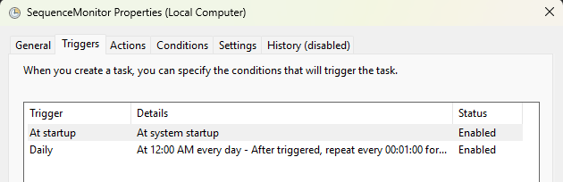

# SequenceMonitor

This is a windows app written to call the Sequence account RESTful endpoint and retrieve balances then save them and if the balance has changed send an optional email alert with the old and new balance.

## Description

 This application functions as a background monitor for Sequence financial accounts.

 1. It parses command-line arguments for authentication, scheduling, and alerting configuration.
 2. It initializes a Serilog logger for console and file outputs (rotated daily).
 3. It enters a continuous loop based on the specified time interval (n seconds).
 4. In each iteration, it performs a secure HTTP POST to the Sequence API using RestSharp.
 5. It deserializes the JSON response and iterates through account balances.
 6. Account balances are rounded to the nearest cent (2 decimal places).
 7. The system compares current balances against the last known state (cached in memory).
 8. If a change is detected, the new record is committed to the MSSQLLocalDB 
 and an email alert is dispatched (if SMTP is configured).

### Features

- Calls a Restful endpoint that returns current account balances from Sequence.

### Built with

- C#
- Install-Package CommandLineParser
- Install-Package RestSharp
- Install-Package Serilog
- Install-Package Serilog.Sinks.Console
- Install-Package Serilog.Sinks.File
- Install-Package Microsoft.Data.SqlClient
- Install-Package Newtonsoft.Json

## Getting started

### Prerequisites

### SQL Database Creation

- All the required database schema objects can be created using the DDL kept in this GitHub repository: [Guyton-Klinger-Withdrawals](https://github.com/CaveArnold/Guyton-Klinger-Withdrawals)

### Install

Built and run from the Release exe location.

### Configure

N/A.

### Usage

SequenceMonitor.exe --token "YOUR_BEARER_TOKEN" `
  --interval 60 `
  --smtp-server "smtp.gmail.com" `
  --smtp-port 587 `
  --email-from "alert@example.com" `
  --email-to "you@example.com" `
  --smtp-user "your_username" `
  --smtp-pass "your_password" `
  --enable-ssl true

- Schedule to run repeatedly using Windows Task Scheduler in case of a computer restart.

### Acknowledgements

Thanks to [RestSharp - Simple .NET REST Client](https://github.com/restsharp/RestSharp?tab=readme-ov-file#restsharp---simple-net-rest-client) developers.

### To-do

- 

### License

This project is licensed under the [GPL-3.0 License](LICENSE.txt).
